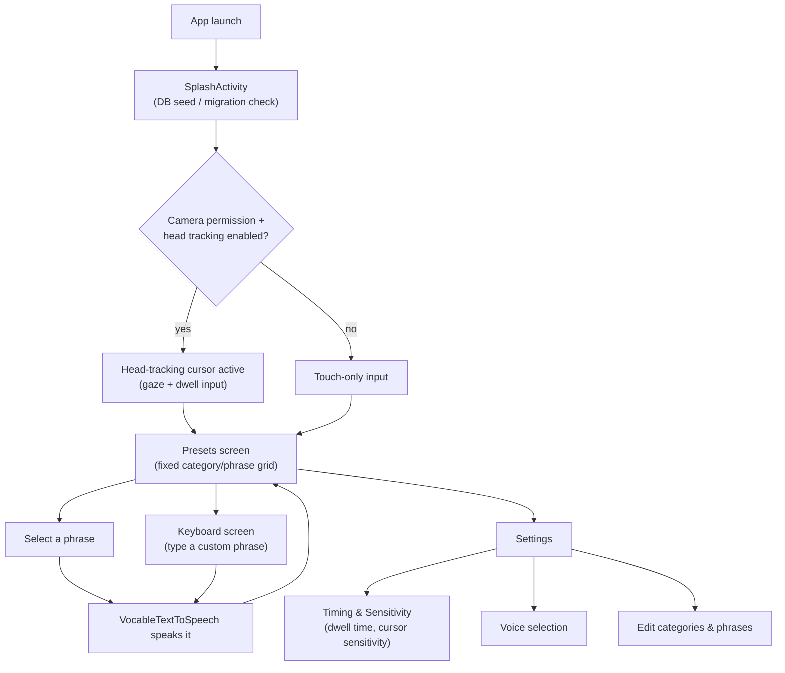
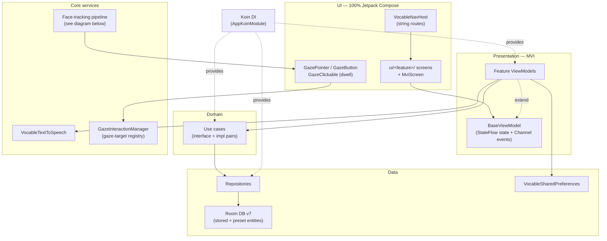
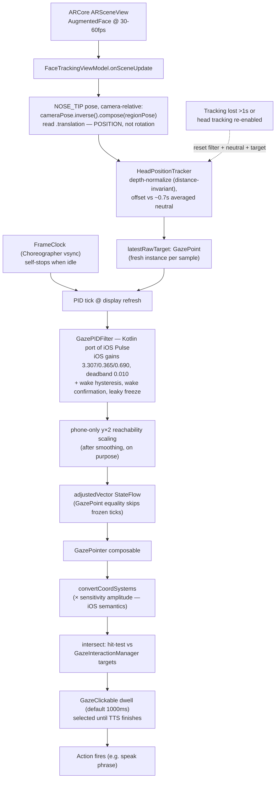

# Vocable Android — Architecture Diagrams

Companion to the written baseline in [`CLAUDE.md`](../CLAUDE.md). GitHub renders the Mermaid
blocks below inline. Kept current as of #678 (PID gaze smoothing + position-based tracking).

## User journey

The core loop: a user selects a phrase (by gaze-dwell or touch) and the app speaks it aloud.

## Tech stack

Single `:app` module; one flat Koin module (`di/AppKoinModule.kt`) wires everything.

## Gaze-cursor pipeline (#678)

Everything below runs on the **main thread** — sceneview delivers ARCore session updates from a
main-thread Choreographer callback, and the PID tick is the same Choreographer. That confinement
is load-bearing (documented on `FaceTrackingViewModel`).

Key #678 decisions behind this shape (full history:
[`work-log/678-pid-gaze-smoothing.md`](work-log/678-pid-gaze-smoothing.md)):

- **Position, not rotation**: ARCore's RGB-fit orientation estimate bends under yaw (vertical
  swoop); the observed nose position doesn't. Same ARCore API — we read `Pose.translation`
  instead of `Pose.zAxis`.
- **PID over lerp**: a fixed blend fraction can't be both fast and stable; the PID (iOS's exact
  shipped controller) can. Several filter choices look like bugs but are deliberate iOS parity —
  read the work-log before "fixing" them.
- **Sensitivity setting** scales cursor travel (in `convertCoordSystems`), never the smoothing —
  matching iOS's `CursorSensitivity` semantics.
