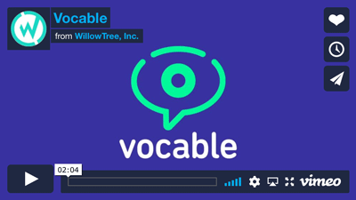

# Vocable AAC for Android

> Empowering people to communicate with care takers and loved ones.

## Contents
- [What is Vocable?](#what-is-vocable)
- [Features](#features)
- [Roadmap](#roadmap)
- [Contributing](#contributing)
- [Requirements](#requirements)
- [Credits](#credits)
- [License](#license)

## What is Vocable?
Vocable AAC allows those with conditions such as MS, stroke, ALS, or spinal cord injuries to communicate using an app that tracks head movements, without the need to spend tens of thousands of dollars on technology to do so.

## Features

### Multimodal User Interface

Vocable uses ARCore to track the user's head movements and understand where the user is looking at on the screen. This allows the app to be used completely hands-free: users can look around the screen and make selections by lingering their gaze at a particular element. 

For users with more mobility, the app can be operated by touch.

### Saved Phrases
Use a list of common phrases provided by speech language pathologists, or create and save your own.

### Full QWERTY Keyboard
Type with your head or your hands.

## Roadmap
For the current progress on features, please visit the [project board](https://github.com/willowtreeapps/vocable-android/projects/1).

For a high-level roadmap, see the [Vocable Roadmap](./ROADMAP.md)

## Contributing
We love contributions! To get started, please see our [Contributing Guidelines](./CONTRIBUTING.md).

## Device Requirements
- [Android devices with ARCore](https://developers.google.com/ar/discover/supported-devices)

## Credits
Matt Kubota, Kyle Ohanian, Duncan Lewis, Ameir Al-Zoubi, and many more from [WillowTree](https://willowtreeapps.com/) 💙.

## License
vocable-android is released under the MIT license. See [LICENSE](LICENSE) for details.

## Other Variants
vocable-ios is available on [Apple Play Store](https://apps.apple.com/us/app/vocable-aac/id1497040547) and is also [open-source](https://github.com/willowtreeapps/vocable-ios). 